# Aleph Edge

**A trading desk that runs on your own machine.** Follow [Sentinel Aleph](https://ribqa.com) signals, run DCA and Grid bots, backtest them on historical candles, and keep your exchange keys in a local encrypted vault, all from one desktop app.

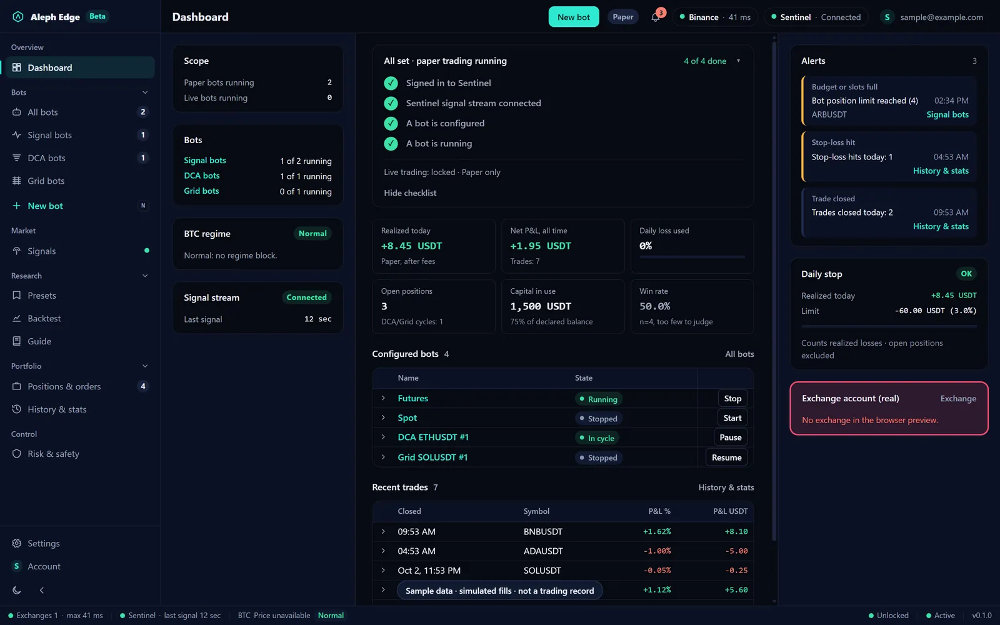

<sub>Screens in this README come from the app's sample-data preview. Every figure in them is sample data, not a trading record.</sub>

Aleph Edge is a Rust + [Tauri 2](https://tauri.app) desktop application with a React front end. Windows is the primary target; the code builds wherever Tauri does.

**What it is in five lines**

- **Simulation first.** Every bot starts on paper, on live Binance prices, with fees, slippage and funding charged.
- **Your keys never leave your device.** There is no Aleph Edge server that could hold them. Only verified trade-only keys are accepted.
- **Real orders are a separate, deliberate build.** The default build cannot place an automated order at all.
- **Nothing is sold on a track record.** Templates ship with the result of their historical test, including the ones that failed.
- **Eight languages, light and dark themes:** English, Türkçe, Español, हिन्दी, Bahasa Indonesia, Português (Brasil), Русский, Tiếng Việt.

---

## Contents

- [Features](#features)
  - [Signal bots](#signal-bots)
  - [DCA bots](#dca-bots)
  - [Grid bots](#grid-bots)
  - [Templates with their verdict](#templates-with-their-verdict)
  - [Backtest](#backtest)
  - [In-app guide](#in-app-guide)
  - [Positions and emergency controls](#positions-and-emergency-controls)
  - [Risk and safety](#risk-and-safety)
  - [Exchange key vault](#exchange-key-vault)
  - [Phone remote control](#phone-remote-control)
- [Simulation and real orders](#simulation-and-real-orders)
- [What this is not](#what-this-is-not)
- [Honesty](#honesty)
- [Build](#build)
- [Configuration](#configuration)
- [Security surfaces](#security-surfaces)
- [Project layout](#project-layout)
- [Licence](#licence)

---

## Features

### Signal bots

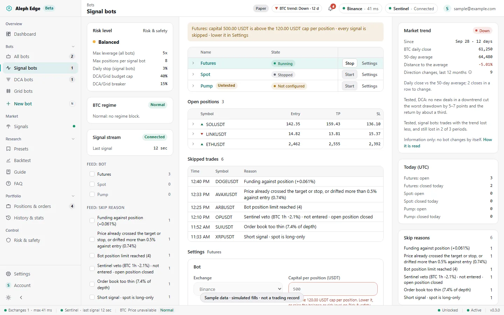

Three bots follow the signals Sentinel Aleph publishes: **Futures**, **Spot** and **Pump**. Each one is configured on its own (capital per position, concurrent positions, leverage cap, take-profit target) and runs inside the limits of your risk level.

Before a signal becomes a position it passes a set of entry checks, and every refusal is recorded with its reason:

- **Funding** against the position side, read from Binance's premium index.
- **Order book depth**, so a position is not sized beyond what the book can take.
- **Price drift**: a signal whose price has already run past the target or stop, or drifted from the entry, is skipped.
- **BTC regime**: Sentinel's BTC veto and regime read; a long against a BTC break is refused, and an open position can be closed when Sentinel vetoes its signal.
- **Position and slot limits** of your risk level, and **spot is long-only**.

The skip log on the right shows what was refused and why, in your language. Open positions are managed with their stop, take profit, breakeven move and time horizon, and survive an app restart.

### DCA bots

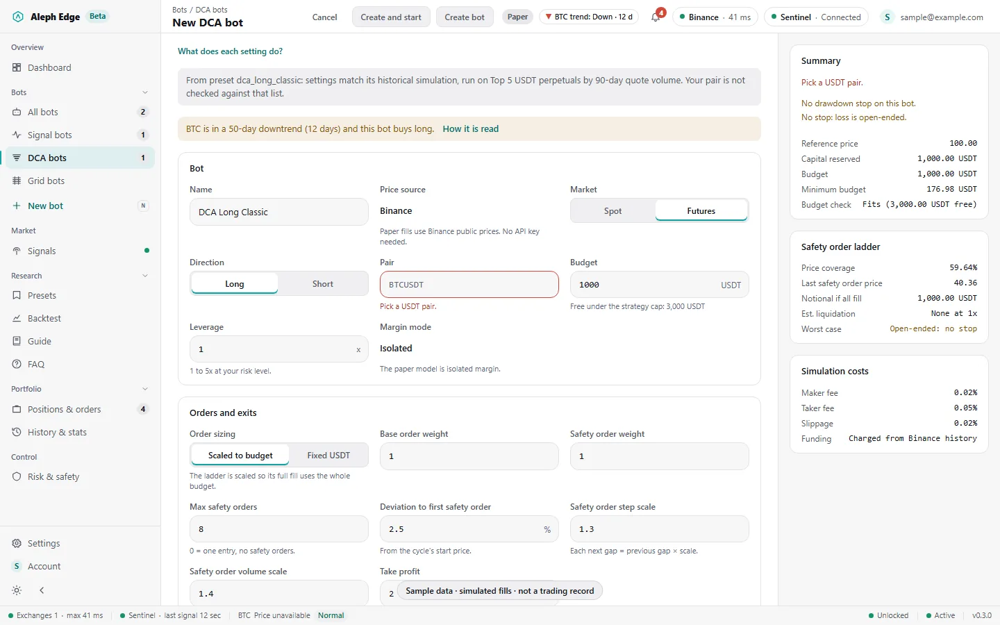

A DCA bot buys a base order, adds safety orders as price falls, and sells the whole position at a take profit above the average entry, cycle after cycle. Short DCA mirrors it.

- **Every setting beside its consequence.** The summary panel shows the safety order ladder with each order's price and size, the price coverage, the estimated liquidation price, the worst case and the simulation costs, recomputed as you type.
- **Settings:** order sizing (scaled to budget or fixed USDT), max safety orders, deviation, step scale, volume scale, take profit, trailing take profit, stop loss, max cycle duration, start condition (immediately or a price trigger), cooldown, cycle limit, price band guard, end time.
- **Protection:** a per-bot drawdown stop that fires inside the candle at its level, a hold on BTC breaks, and a portfolio breaker shared across bots.
- **Guard rails:** the form refuses a trailing deviation at or above the take profit, a stop that would fire before the next safety order, a ladder past the liquidation price, and orders below the exchange minimum. A leveraged DCA with the stop off asks for confirmation and states its liquidation distance.

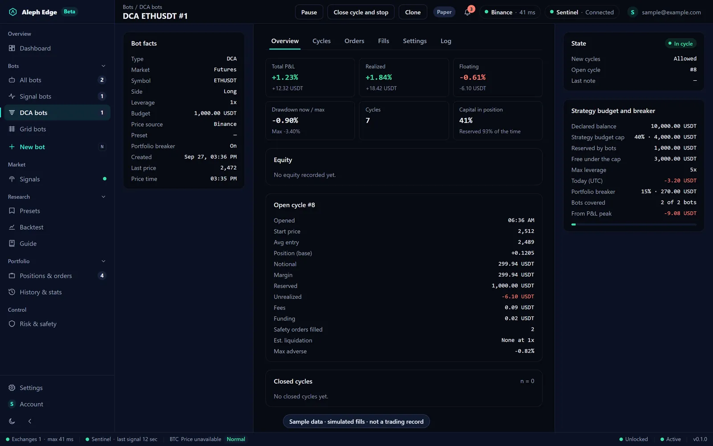

Each bot has an overview, its cycles, orders, fills, settings and a log, with pause, close-and-stop, clone and delete.

### Grid bots

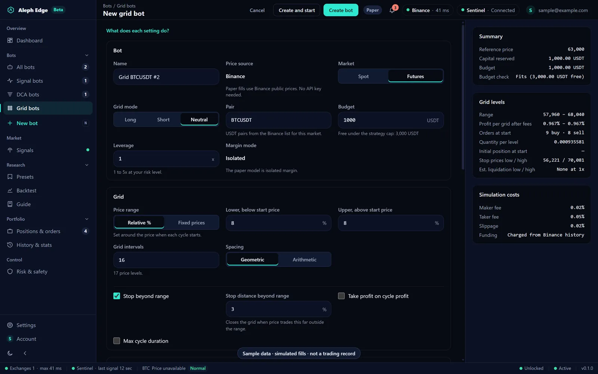

A Grid bot splits a price range into steps, buys below the start price and sells above it, and takes one step of profit each time price crosses a level and comes back. Neutral, long and short modes; relative or fixed range; geometric or arithmetic spacing; a stop beyond the range; trailing up for long grids; take profit on cycle profit. The summary shows the profit per grid after fees, the orders at start, the stop prices and the worst-case liquidation band.

### Templates with their verdict

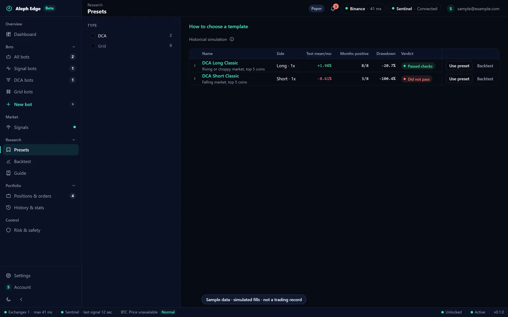

Twelve DCA and Grid templates (long, short, BTC-only, altcoins, with a stop, four grids) for people who do not want to tune settings by hand. Their settings were fixed before any test, then each one was simulated once over two years of Binance futures data and judged by the same four checks:

1. a positive average return per bot-month in the training, validation **and** test periods;
2. the 95% confidence interval of the test result above zero;
3. every test month positive;
4. no liquidation.

**Two templates passed** (DCA Long Classic and DCA Long Safe). The other ten are kept for learning, marked **Did not pass** with the checks they missed, and the app asks before one is used. Both short DCA templates were liquidated even at 1x; all four grids lost money in most periods. A passed template only shows that it worked in those two years under those rules.

### Backtest

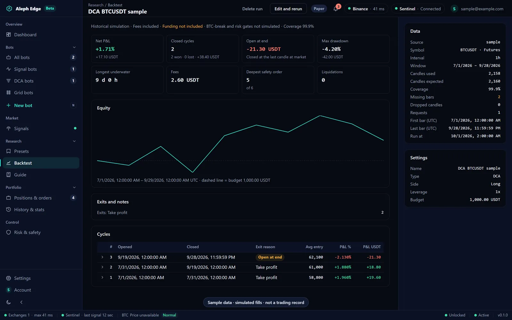

Run any DCA or Grid configuration on historical candles (15 min, 1 h, 4 h or 1 day; 30 days to 2 years, or a custom window) with the same engine the live bots use. The report shows net result, max drawdown, longest time underwater, fees, deepest safety order, liquidations, the equity curve and every cycle with its exit reason, plus the data coverage it ran on. Runs are stored locally and can be rerun, deleted one by one or cleared.

### In-app guide

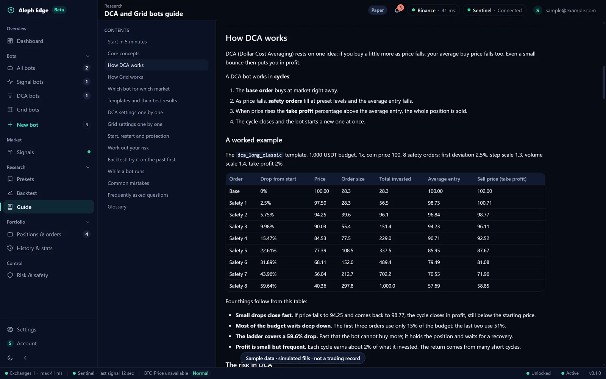

A handbook inside the app, in English and Turkish: start in five minutes, core concepts, a DCA ladder and a grid worked through with numbers, which bot suits which market, the template results, every setting, how to work out your risk, how to read a backtest, common mistakes, FAQ and a glossary. The bot forms and the presets page link straight to the relevant section.

### Positions and emergency controls

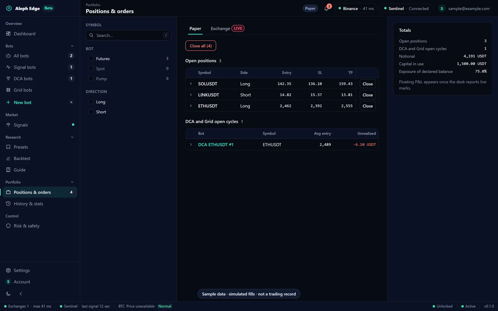

Simulated positions and DCA/Grid cycles on one tab, the real exchange account on another, never mixed. **Close all** on the simulated tab stops the signal bots first, then closes every simulated position and cycle at market. The exchange tab shows your real positions and can close them with reduce-only market orders behind a typed confirmation.

### Risk and safety

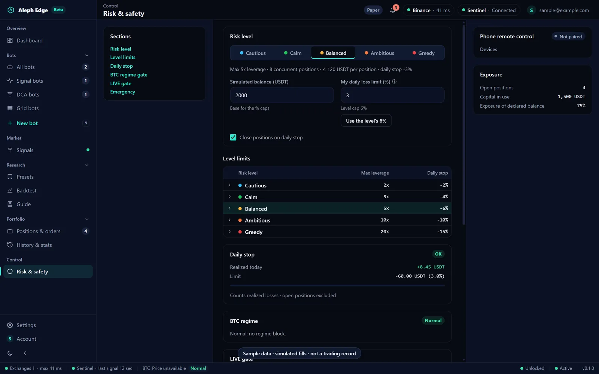

| Risk level | Max leverage | Daily stop | DCA / Grid budget cap |
|---|---|---|---|
| Cautious | 2x | −2% | 20% |
| Calm | 3x | −4% | 30% |
| Balanced | 5x | −6% | 40% |
| Ambitious | 10x | −10% | 60% |
| Greedy | 20x | −15% | 80% |

- A **daily stop** on realized losses stops the signal bots and can close their open positions; they cannot be started again until the next UTC day (DCA and Grid are accounted for separately).
- A **portfolio breaker** closes the DCA and Grid bots inside it when their combined loss reaches 15% of their budgets.
- The **BTC regime** read is shown live and gates entries.
- The **LIVE gate** states whether this build can place real orders at all.
- **Emergency** controls stop every bot and close every simulated cycle, behind a confirmation.

### Exchange key vault

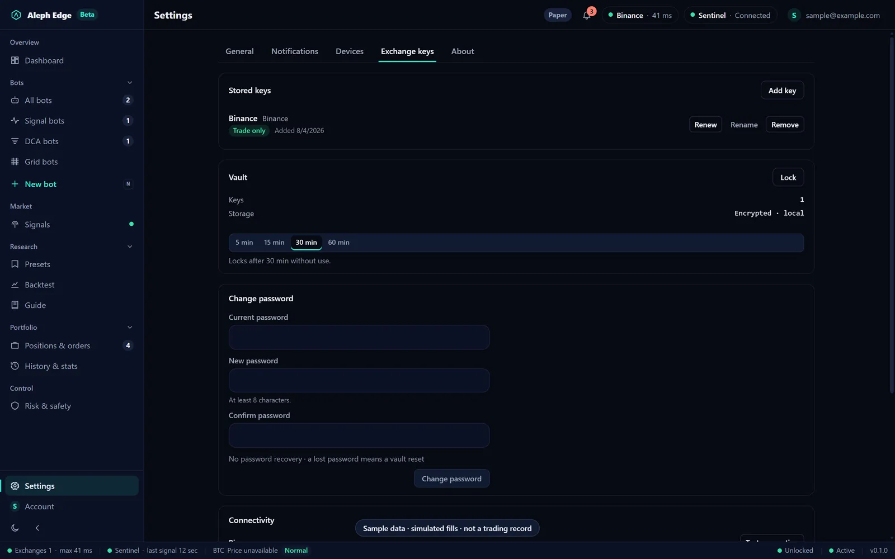

API keys live in a local vault: Argon2id key derivation (64 MiB), AES-256-GCM, with the salt kept in the OS keychain, so the vault file alone cannot be opened on another machine. Secrets are wiped from memory when they go out of scope and never cross into the UI.

- **Only verified trade-only keys are accepted.** A key's real permissions are read from Binance's signed `apiRestrictions` endpoint; a key that can withdraw, a key Binance cannot be asked about, and keys for exchanges without a verifier are refused.
- Renew a key in place (the old one stays until the new one is accepted), rename it, remove it.
- Change the vault password; choose auto-lock after 5, 15, 30 or 60 minutes without use.
- There is no password recovery by design: a lost password means resetting the vault.

### Phone remote control

Pair a phone by QR code under Settings, Devices. The desk accepts signed, single-use, time-limited pairing and HMAC-verified messages through a relay that carries messages but cannot originate them. The mobile app itself is not published yet.

---

## Simulation and real orders

| | Default build | Live build (`--features live`) |
|---|---|---|
| Signal bots | Simulation | Simulation, or real orders per bot after a typed `LIVE` opt-in |
| DCA and Grid bots | Simulation | Simulation (real orders are not implemented) |
| Manual close on the exchange tab | Real reduce-only orders | Real reduce-only orders |

Real automated orders need all of these at once: a build compiled with the `live` feature, a Futures bot on Binance, the typed `LIVE` confirmation for that bot, and a verified trade-only key in an unlocked vault. A position's live flag read back from disk is checked against the same compile-time switch, so a file cannot turn trading on.

The manual **Close position** and **Close all** on the exchange tab are the exception in every build: they send real reduce-only market orders so you can flatten an account the desk is watching. They cannot open a position or move funds, and they sit behind a typed confirmation.

Try a live build on the **Binance Futures testnet** first (see [Configuration](#configuration)); the top bar then shows TESTNET.

---

## What this is not

**Not an exchange client you log into.** There is no Aleph Edge account holding your funds. The desk talks to your exchange with your own API keys, from your own machine.

**Not a signal service with a track record to sell you.** This repository makes no win-rate claim; see [Honesty](#honesty).

**Not tested in the field with real money.** The simulation path has been exercised end to end; the live order path has been reviewed and unit-tested. Treat every build as software that has not met a real market day with your money. If you point it at an exchange key, point it at one that can lose nothing you mind losing.

**Not independently audited.** It has been through internal adversarial reviews; the defects that could move money were fixed before publication. It handles exchange credentials: read the vault code before you trust it with a key that can trade.

---

## Honesty

The signal system this desk consumes has been measured on its own history, and the measurements are not flattering. They are published here because a reader will find them anyway.

**Entry selection carries no measurable information.** Three independent tests, three nulls:

| Test | What it asks | Result |
|---|---|---|
| AUC | Does the score separate winners from losers? | **0.496** (0.5 = coin flip) |
| Information coefficient | Does the score rank one signal above another? | **−0.002** |
| Drift-aware placebo | Does entry *timing* beat a random entry on the same tape? | **−1.6pp** |

The placebo is the one that matters: 1,335 real signals against 6,581 random-timed entries on the same symbols and the same geometry. Ours won 47.9% of the time, random timing won 49.5%.

**The published win rate is mostly geometry and drift, not selection.** At a 2.5×ATR stop and the target used, a driftless entry earns roughly 62% by the barrier law alone. Any headline number has to be read against that baseline, not against 50%.

**The one positive result is position management, not entry.** Managing an open position measured better than not managing it. That is what this desk implements.

**Failures are real and visible.** Wins land near +2.3%, losses near −3.8%. A run of stop-outs is the expected behaviour of a system with no entry edge, not a malfunction.

---

## Build

Requirements:

- **Node.js** ≥ 18 and npm
- **Rust** (stable) and Cargo: https://rustup.rs
- **Tauri prerequisites:** https://tauri.app/start/prerequisites (on Windows: Microsoft C++ Build Tools and WebView2, bundled on Windows 11)

```bash
npm install
```

Run the desktop app in development:

```bash
npm run tauri dev
```

The front end alone, in a browser, on sample data:

```bash
npm run dev
```

Then open `http://localhost:1420/?shot=dashboard` (other screens: `bots`, `dca-new`, `grid-new`, `presets`, `backtest-report`, `guide`, `positions`, `risk`, `accounts`).

Production bundle (simulation only):

```bash
npm run tauri build
```

Live build, able to place real orders after the per-bot opt-in:

```bash
npm run tauri build -- --features live
```

Tests:

```bash
npm test
```

```bash
cargo test --manifest-path src-tauri/Cargo.toml
```

---

## Configuration

These are process environment variables (see `.env.example`); the app does not read a `.env` file itself.

```
ALEPH_EDGE_API_BASE              which Sentinel deployment to talk to (default https://ribqa.com)
ALEPH_EDGE_RELAY_URL             phone relay; leave empty to derive it from the API base
ALEPH_EDGE_BINANCE_FUTURES_BASE  production (default) or https://testnet.binancefuture.com; anything else falls back to production
ALEPH_EDGE_VAULT_IDLE_MINUTES    default auto-lock, 1-1440; the choice made in Settings overrides it
```

The front end carries no host at all; it asks the Rust core for every endpoint. The CSP and the update public key are pinned in `src-tauri/tauri.conf.json`.

---

## Security surfaces

If you are reading this repository with an attacker's eye, these are the places worth your time:

**The vault** (`src-tauri/src/vault/`): key derivation, on-disk format, how long plaintext stays in memory, the password change and key renewal paths, and the permission check that refuses withdraw-enabled keys.

**The pairing protocol** (`crates/aleph-link`, `crates/aleph-desk-link`): HMAC verification, replay protection, TTL enforcement and whether the single-use claim holds. The phone half lives in the mobile app, which is not published yet.

**The relay trust boundary:** the relay is supposed to carry messages, not originate them. Assume you own the relay: what can you do?

**The automated-trading gate:** `live_trading_allowed()` in `src-tauri/src/bot/engine/live.rs` and `bot_set_live` in `src-tauri/src/bot/commands.rs`. Try to reach an automated order without the `live` feature, the per-bot opt-in, a Futures bot on Binance and a verified trade-only key.

**The manual close commands:** `exchange_close_position` and `exchange_close_all` in `src-tauri/src/exchange/commands.rs` send real orders by design. Anything able to run script in the webview could invoke them while the vault is unlocked. If you find a way to reach them without the user pressing the button, tell us.

Report security issues to <support@ribqa.com> with "security" in the subject, and give us a chance to fix them before publishing.

---

## Project layout

```
src/                      React front end (pages, components, i18n in 8 languages, in-app guide)
src-tauri/src/bot/        signal bot engine, DCA/Grid strategy engine, backtest
src-tauri/src/vault/      encrypted key vault
src-tauri/src/exchange/   Binance clients (public prices, signed account and close orders)
src-tauri/src/signal/     Sentinel signal stream, vetoes, backfill
src-tauri/src/membership/ sign-in and session refresh against Sentinel
crates/aleph-link         pairing and message protocol (shared)
crates/aleph-desk-link    desk side of the phone link
```

---

## Licence

[PolyForm Perimeter 1.0.1](LICENSE).

In plain words: use it, change it, run it on your own account, keep your changes private or publish them. The one thing the licence does not allow is using it to offer a product that competes with this one, including for free. If you want that, ask: <dev@ribqa.com>.

## Contact

Questions and bug reports: <support@ribqa.com>.
